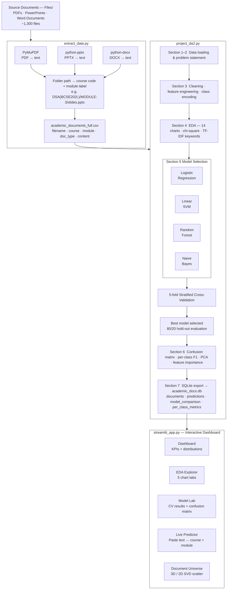

# Course and Module Identifier Platform

**Automated NLP classification of academic course materials across 16 university subjects**

A full end-to-end data science pipeline that extracts text from over 1,300 PDFs, PowerPoints, and Word documents, trains four competing machine learning classifiers, and surfaces everything through an interactive Streamlit dashboard — complete with a live prediction interface where any pasted text is instantly routed to its course and module.

## Table of Contents

- [Overview](#overview)
- [Architecture](#architecture)
- [Pipeline Stages](#pipeline-stages)
- [Project Structure](#project-structure)
- [Courses Covered](#courses-covered)
- [Models & Performance](#models--performance)
- [Dashboard Pages](#dashboard-pages)
- [Getting Started](#getting-started)
- [Visualisations Produced](#visualisations-produced)
- [Tech Stack](#tech-stack)

## Overview

Academic institutions accumulate thousands of lecture notes, slides, syllabi, and reference materials spread across many courses. Manually routing each document to the correct course and module is error-prone and time-consuming. This project builds a multi-class NLP classifier that:

- Automatically identifies **which course** a document belongs to
- Optionally predicts **which module** within that course
- Achieves **≥ 80% cross-validated accuracy** and **macro F1 ≥ 0.75**
- Exposes all of this through a production-quality interactive dashboard

## Architecture



## Pipeline Stages

### Stage 1 — Text Extraction (`extract_data.py`)

Recursively walks the `Files/` directory tree. The folder structure encodes ground-truth labels:

```
Files/
└── DSA(BCSE202L)/
    ├── MODULE-1/
    │   ├── lecture_notes.pdf       →  course: DSA,  module: module_1
    │   └── slides.pptx             →  course: DSA,  module: module_1
    ├── Syllabus/
    │   └── syllabus.pdf            →  doc_type: syllabus
    └── Question Papers/
        └── CAT1_2023.pdf           →  doc_type: question_paper
```

Each file yields one row in the output CSV with columns: `filename`, `course_code`, `course_label`, `module_label`, `doc_type`, `file_format`, `word_count`, `char_count`, `extraction_status`, `content`.

### Stage 2 — Preprocessing & Feature Engineering (`project_da2.py`, Section 3)

| Step | Detail |
|---|---|
| Text normalisation | Whitespace collapse, strip, fill nulls |
| Minimum length filter | Drop documents with fewer than 30 words |
| Word count cap | 99th-percentile cap for outlier-safe visualisation |
| Feature engineering | `word_count`, `char_count`, `unique_words`, `lexical_diversity` |
| Label encoding | `sklearn.LabelEncoder` on course labels |
| Class imbalance | `class_weight="balanced"` on all classifiers |

### Stage 3 — Exploratory Data Analysis (Section 4)

Fourteen publication-quality charts are produced covering course distribution, document type composition, file format breakdown, word count violin plots, per-course summary statistics, top TF-IDF keywords, lexical diversity, module coverage heatmap, and cross-course vocabulary overlap.

A chi-square test quantifies whether document type distribution is statistically associated with course label.

### Stage 4 — Model Training & Selection (Section 5)

All four classifiers share the same TF-IDF vectoriser configuration:

```
TfidfVectorizer(
    max_features = 10,000
    ngram_range  = (1, 2)        # unigrams + bigrams
    sublinear_tf = True          # log-scaled term frequency
    stop_words   = "english"
    min_df       = 2             # ignore hapax legomena
)
```

Selection criterion: highest 5-fold stratified cross-validated accuracy with stable standard deviation across folds. The winning model is then retrained on an 80/20 stratified split for held-out evaluation.

### Stage 5 — Evaluation (Section 6)

| Chart | Description |
|---|---|
| Model comparison bar chart | Accuracy, macro F1, Precision, Recall side-by-side for all four models |
| Confusion matrix (counts) | Raw prediction errors on the 20% held-out test set |
| Confusion matrix (row %) | Normalised to highlight relative error rates per class |
| Per-class P / R / F1 | Grouped bar chart for every course |
| Feature importance | Top 10 Logistic Regression coefficients per course |
| PCA / document space | TF-IDF → SVD(2D) scatter — each point is one document |
| Keyword overlap heatmap | Shared top-200 TF-IDF terms between every course pair |

### Stage 6 — Database Export (Section 7)

Results are written to `academic_docs.db` (SQLite) with four tables:

| Table | Contents |
|---|---|
| `documents` | Full cleaned corpus with all engineered features |
| `predictions` | Actual course, predicted course, correct flag |
| `model_comparison` | 5-fold CV scores for all four models |
| `per_class_metrics` | Precision, recall, F1, support per course |

## Project Structure

```
FDS/
├── Project Review/
│   ├── extract_data.py                     Stage 1: text extraction pipeline
│   ├── project_da2.py                      Stage 2–6: ML pipeline + charts
│   ├── streamlit_app.py                    Interactive dashboard
│   ├── requirements.txt
│   │
│   ├── academic_documents_full.csv         Output of extract_data.py
│   ├── academic_documents_with_extracted_text.csv   Fallback dataset
│   ├── academic_documents.xlsx
│   ├── academic_docs.db                    SQLite export
│   │
│   ├── fig1_course_distribution.png
│   ├── fig2_doc_types_by_course.png
│   ├── fig3_file_formats_by_course.png
│   ├── fig4_word_count_violin.png
│   ├── fig5_summary_statistics.png
│   ├── fig6_keywords_per_course.png
│   ├── fig7_lexical_diversity.png
│   ├── fig8_module_heatmap.png
│   ├── fig9_model_comparison.png
│   ├── fig10_confusion_matrix.png
│   ├── fig11_per_class_metrics.png
│   ├── fig12_feature_importance.png
│   ├── fig13_document_pca.png
│   └── fig14_keyword_overlap.png
│
└── FDS_Report.pdf
```

## Courses Covered

| Course Code | Short Label | Subject |
|---|---|---|
| BMAT201L | CVLA | Complex Variables & Linear Algebra |
| BCSE205L | CAO | Computer Architecture & Organisation |
| BCSE308L | CN | Computer Networks |
| BCSE302L | DBMS | Database Management Systems |
| BECE306L | DCS | Digital Communication Systems |
| BCSE202L | DSA | Data Structures & Algorithms |
| BECE102L | DSD | Digital System Design |
| BECE301L | DSP | Digital Signal Processing |
| BCSE206L | FDS | Foundations of Data Science |
| BCSE401L | IoT | Internet of Things |
| BCSE209L | ML | Machine Learning |
| BECE204L | MPMC | Microprocessors & Microcontrollers |
| BCSE303L | OS | Operating Systems |
| BMAT202L | PS | Probability & Statistics |
| BCSE304L | TOC | Theory of Computation |
| BCSE203E | WP | Web Programming |

## Models & Performance

Four scikit-learn pipelines are evaluated. All use the same TF-IDF front-end; classifiers differ in how they use the resulting sparse matrix.

```
Model               Strength on sparse TF-IDF vectors
────────────────    ──────────────────────────────────────────────────────
Logistic Regression  Linear decision boundaries; calibrated probabilities
                     via predict_proba — enables confidence-ranked output
                     in the live predictor.

Linear SVM           Maximises margin on the high-dimensional sparse space;
                     typically the fastest to converge and highly competitive
                     with LR on text tasks.

Random Forest        Ensemble of decision trees; effective on dense features
                     but less suited to sparse 10k-dimensional TF-IDF vectors
                     where individual feature splits carry limited signal.

Naive Bayes          Strong baseline for text; assumes feature independence
                     but scales excellently and is robust to rare terms.
```

**Success criteria (5-fold cross-validated):**

- Course classification accuracy ≥ 80%
- Macro-averaged F1 ≥ 0.75

The module-level classifier (secondary task) is a Logistic Regression trained only on documents whose module label is known and with at least 3 examples.

## Dashboard Pages

The Streamlit app has five pages, each rendered with a dark glassmorphism theme using Playfair Display typography.

```
Navigation bar
├── Dashboard
│     6 KPI cards (total docs, unique courses, best CV accuracy,
│     best F1 macro, avg word count, largest class)
│     Course distribution bar chart
│     Pipeline architecture overview panel
│     Donut chart showing class split
│
├── EDA Explorer
│     Tab: Document Types   — stacked bar per course
│     Tab: File Formats     — stacked bar per course
│     Tab: Word Count       — box plot + violin plot + stats table
│     Tab: Module Map       — course × module heatmap
│     Tab: Keyword Overlap  — cross-course shared vocabulary heatmap
│
├── Model Lab
│     Champion model banner with CV metric badges
│     Tab: Model Comparison  — grouped bar + CV table
│     Tab: Confusion Matrix  — counts + row-normalised side by side,
│                              top misclassification pairs
│     Tab: Per-Class Metrics — P / R / F1 bar chart + styled table
│
├── Live Predictor
│     Text input area
│     Predict Course button
│     → Predicted course + confidence score
│     → Predicted module + confidence score
│     → Confidence bar chart for all courses (top 10)
│     → Confidence bar chart for all modules (top 8)
│     Load Random Document button for instant demos
│
└── Document Universe
      3D interactive scatter (TF-IDF → SVD projection)
      2D scatter fallback
      Colour by: Course / Doc Type / Word Count
      Explained variance badges for all 3 components
```

## Getting Started

**1. Install dependencies**

```bash
python3 -m venv venv
source venv/bin/activate
pip install -r "Project Review/requirements.txt"
```

**2. Extract document text**

Place all course material folders inside `Project Review/Files/`, preserving the folder naming convention `CourseName(COURSECODE)/MODULE-N/`.

```bash
cd "Project Review"
python3 extract_data.py
```

This produces `academic_documents_full.csv`. The script prints progress every 50 files and gives a final extraction summary.

**3. Run the analysis pipeline**

```bash
python3 project_da2.py
```

This runs all six sections, saves 14 charts as PNGs, and writes `academic_docs.db`. Expect output like:

```
  Best model: Logistic Regression  (93.2% accuracy, 0.921 F1)
  Figures saved: fig1 → fig14
  SQLite DB: academic_docs.db
```

**4. Launch the dashboard**

```bash
streamlit run streamlit_app.py
```

Open `http://localhost:8501` in a browser. The app caches data loading and model training on first run; subsequent page switches are instant.

## Visualisations Produced

| Figure | Description |
|---|---|
| `fig1_course_distribution.png` | Horizontal bar — document count per course |
| `fig2_doc_types_by_course.png` | Stacked bar — slides vs notes vs syllabus vs question paper |
| `fig3_file_formats_by_course.png` | Stacked bar — PDF vs PPTX vs DOCX per course |
| `fig4_word_count_violin.png` | Violin plot — document length distribution per course |
| `fig5_summary_statistics.png` | Styled table — N, mean, median, std, min, max word counts |
| `fig6_keywords_per_course.png` | Grid of bar charts — top 12 TF-IDF terms per course |
| `fig7_lexical_diversity.png` | Bar chart — unique/total word ratio per course |
| `fig8_module_heatmap.png` | Heatmap — document count at course × module intersections |
| `fig9_model_comparison.png` | Grouped bar — Accuracy, F1, Precision, Recall for all 4 models |
| `fig10_confusion_matrix.png` | Side-by-side — raw counts and row-normalised percentages |
| `fig11_per_class_metrics.png` | Grouped bar — Precision, Recall, F1 per course |
| `fig12_feature_importance.png` | Grid — top 10 LR coefficients per course |
| `fig13_document_pca.png` | 2D scatter — TF-IDF → SVD projection, coloured by course |
| `fig14_keyword_overlap.png` | Heatmap — shared top-200 TF-IDF terms between course pairs |

## Tech Stack

| Layer | Libraries |
|---|---|
| Text extraction | PyMuPDF (fitz), python-pptx, python-docx |
| Data manipulation | pandas, numpy |
| Machine learning | scikit-learn (TfidfVectorizer, LogisticRegression, LinearSVC, RandomForestClassifier, MultinomialNB, TruncatedSVD) |
| Statistical testing | scipy (chi2_contingency) |
| Static visualisation | matplotlib, seaborn |
| Interactive charts | plotly |
| Dashboard | Streamlit |
| Persistence | SQLite (via Python stdlib sqlite3), openpyxl |
